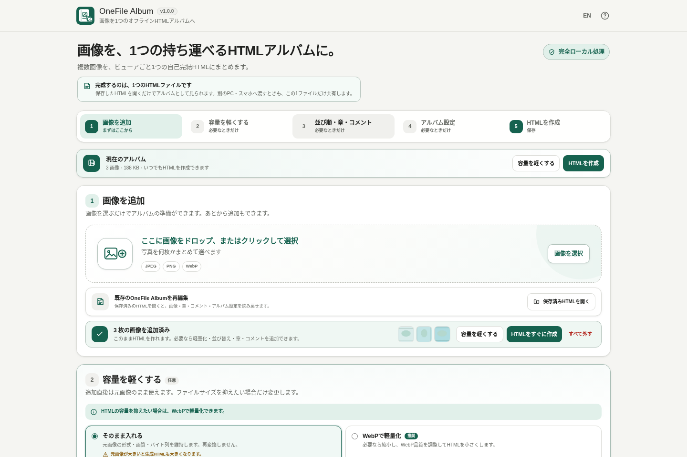

# OneFile Album

[](https://github.com/ttomohisa/htmlapps-onefile-album/actions/workflows/deploy-pages.yml)
[](LICENSE)
[](https://ttomohisa.github.io/htmlapps-onefile-album/)

[日本語版 README](README.ja.md)

A privacy-focused, single-HTML app that packages multiple local images together with a responsive viewer into **one self-contained HTML album**.

## 🚀 Live demo

### [Open OneFile Album on GitHub Pages](https://ttomohisa.github.io/htmlapps-onefile-album/)

GitHub Pages delivers only the initial application HTML. After it loads, image reading, WebP optimization, sorting, chapters, comments, preview, album generation, and saved-album re-editing are processed locally on your device. The images you select are not uploaded by the app.

[](https://ttomohisa.github.io/htmlapps-onefile-album/)

## Features

- **Turn many images into one portable album** — Package JPEG / PNG / WebP images together with the viewer into one HTML file that can be opened directly later.
- **Keep originals or make the album lighter** — Preserve the source image bytes, or resize and re-encode them to WebP with a clear BEFORE → AFTER size comparison.
- **Organize without breaking your flow** — Sort by file name or EXIF capture time, reorder by drag and drop, move multiple selected images together, and change the card size when needed.
- **Add structure and context** — Insert chapter dividers, collapse large chapters while editing, and attach comments to individual images.
- **Re-edit saved albums** — Open a previously generated OneFile Album HTML, restore its embedded images and editing metadata, then revise and create a new file.
- **Preview before creating the file** — Open the same generated viewer in a final preview before saving the album.
- **A viewer that travels with the images** — Thumbnails, previous / next navigation, swipe, pinch zoom, fullscreen, slideshow, search, viewer settings, and extraction of the current embedded image are all included.
- **Private, single-HTML operation** — No runtime network requests, no account, Japanese / English UI, and no server required for the generated album.

## Quick start

### Use the web demo

Just [open the demo](https://ttomohisa.github.io/htmlapps-onefile-album/). No installation or account is required.

### Use the download file

1. Download `dist/index.html` from this repository.
2. Open it in a current Chromium-based browser, Firefox, or Safari.
3. Add your images and create the album.

The application itself and the generated album both work directly from `file://`; a local web server is not required.

### Build it fully offline (advanced)

1. Download or clone this repository.
2. Double-click `build-standalone.bat` on Windows.
3. Copy the generated `dist/index.html` wherever you need it.
4. Open that single file later without an internet connection.

Python, Node.js, and a local web server are not required. The builder uses Windows PowerShell and the built-in `tar.exe`. The current app has no bundled third-party runtime library dependency.

## Usage

The shortest path is **Add images → Create HTML**. Optimization and organization are optional.

1. **Add images** — Add JPEG / PNG / WebP files by picker or drag and drop. The original image bytes are immediately available for album creation.
2. **Reduce file size (optional)** — Choose WebP optimization when you want a smaller album. Compare the total original image size with the images that will be embedded in the HTML.
3. **Order, chapters & comments (optional)** — Sort automatically, drag cards into a new order, create chapter dividers, collapse chapters, or add comments.
4. **Album settings (optional)** — Set the album title, choose or create a favicon, and configure the generated viewer.
5. **Create HTML** — Check the estimated output size, open the final preview if needed, choose the filename, and create the self-contained HTML album.

On mobile, the same five stages are available as fixed bottom tabs: **Add / Optimize / Organize / Album / Export**. Card sorting starts with a short long-press so a normal vertical swipe can still scroll the page.

### Re-edit a saved album

Choose **Open saved HTML** in the first stage and select a OneFile Album HTML that you generated earlier. The editor restores the embedded images, chapters, comments, album title, favicon, viewer settings, and supported editor settings, so the HTML itself can act as the saved album format.

### Keep originals or optimize with WebP

**Keep originals** embeds the JPEG / PNG / WebP source bytes as the full-image payload. This avoids full-image re-encoding, keeps metadata already present in those bytes, and allows the viewer to extract the embedded image again in its original format.

**WebP optimization** uses browser-native decoding and Canvas APIs. The default maximum long edge is the original size, with 3840 / 2560 / 1920 / 1280 px presets and validated custom input from 320 to 16384 px. WebP re-encoding does not guarantee preservation of the source EXIF / GPS metadata.

### Selecting and reordering images

- Use the selection control in the upper-right corner of a card to select or clear that image.
- Use **Select all** or **Clear selection** for bulk selection changes.
- Drag any non-interactive part of a card to reorder it.
- If multiple images are selected, dragging one selected card moves the selected group together while preserving relative order.
- On mobile, briefly hold a card before moving it. The insertion marker is horizontal in the single-column layout.
- Bulk removal and removing all images require confirmation.

### Chapters and comments

A chapter marks the start of a group of images. Chapter boundaries stay stable when images are moved across them, and large chapters can be collapsed in the editor while keeping the image count visible. Each image can also have an optional comment that appears in the generated viewer when comment display is enabled.

## Generated viewer

The generated HTML contains both the image payloads and the viewer. It works without OneFile Album being installed and without a server.

The viewer includes:

- Thumbnail navigation and previous / next buttons
- Keyboard left / right navigation
- Touch swipe navigation while not zoomed
- Zoom buttons, double-click zoom, pinch zoom, and pan while zoomed
- Fullscreen with optional automatic control-bar hiding
- Slideshow with 2 / 3 / 5 / 8 / 10 second intervals and optional looping
- Search across file names, chapter titles, and comments
- Viewer options for file-name / chapter / comment visibility, initial fit / actual-size display, background, thumbnail size, slideshow UI auto-hide, and fullscreen UI auto-hide
- Extraction of the currently displayed embedded image

### Keyboard shortcuts in the generated viewer

| Shortcut | Action |
| --- | --- |
| `←` / `→` | Previous / next image |
| `+` / `-` | Zoom in / out |
| `0` | Reset view |
| `Space` | Start / stop slideshow |
| `Ctrl` / `⌘` + `S` | Save the current embedded image |
| `Esc` | Close the active search field or dialog where applicable |

## Large HTML files

Because the images are embedded into the HTML, output size can become large. There is no single universal browser limit: practical behavior depends on image dimensions, browser, device memory, and the generated file size.

OneFile Album shows practical guidance instead of claiming a hard maximum:

| Estimated HTML size | Guidance |
| --- | --- |
| Under 50 MB | Light |
| 50–120 MB | Normal |
| 120–250 MB | Use caution on phones |
| Above 250 MB | Splitting into multiple albums is recommended |

The generated viewer uses small thumbnails for browsing and creates full-image Blob URLs only around the current image instead of decoding every full image at once.

## Publish with GitHub Pages

The repository includes a workflow that builds the standalone HTML, verifies it, and deploys `dist` to GitHub Pages automatically.

1. Push the repository to GitHub as `htmlapps-onefile-album`.
2. Open **Settings → Pages → Build and deployment → Source** and select **GitHub Actions**.
3. Push to `main`, or manually run **Deploy standalone app to GitHub Pages** from the Actions tab.
4. After a successful deployment, the demo is available at `https://ttomohisa.github.io/htmlapps-onefile-album/`.

Each push to `main` runs the repository checks, rebuilds the standalone HTML, verifies offline constraints, and publishes the `dist` directory when GitHub Pages is enabled.

## Development and build layout

```text
.
├─ src/index.template.html       # Application template
├─ app.config.json               # App metadata and build settings
├─ dependencies.json             # Optional embedded dependency definitions
├─ build-standalone.bat          # Windows build entry point
├─ build-standalone.ps1          # Standalone HTML builder
├─ scripts/
│  ├─ check-repository.ps1       # Repository validation entry point
│  ├─ verify-standalone.ps1      # Standalone / offline verification
│  └─ build-self-extract.ps1     # Self-extracting HTML builder
├─ dist/
│  ├─ index.html                 # Readable standalone application
│  └─ index.self-extract.html    # Smaller self-extracting standalone build
└─ .github/workflows/
   ├─ build-standalone.yml       # Pull request build validation
   └─ deploy-pages.yml           # Automatic Pages deployment from main
```

### Build locally

Run:

```bat
build-standalone.bat
```

The build process:

- Loads application metadata from `app.config.json`
- Embeds configured assets from `dependencies.json` when dependencies are present
- Replaces build placeholders in `src/index.template.html`
- Generates `dist/index.html`
- Verifies standalone / offline requirements
- Generates the smaller `dist/index.self-extract.html`
- Writes build-size and dependency manifests under `dist/`

The current `dependencies.json` contains no runtime third-party libraries, so OneFile Album uses browser APIs directly for image decoding, Canvas processing, drag interactions, fullscreen, and file generation.

## Privacy and runtime network protection

The generated application and generated albums use a Content Security Policy containing `connect-src 'none'`. Selected image data stays in browser memory and is not uploaded by the application.

The GitHub Pages version requires the initial HTML request to load the app, but image processing and album creation are local. For use with the network completely disconnected, open `dist/index.html` locally.

Saved viewer preferences may use browser-local storage when available, but source image bytes are not persisted there by the editor.

## Limitations

- Input formats in v1.0.0 are JPEG / PNG / WebP.
- HEIC / HEIF is not supported.
- Animated images may be treated as still images when WebP optimization is used.
- WebP optimization re-encodes the image and does not preserve original EXIF / GPS metadata.
- Extremely large image dimensions can exceed browser Canvas or device-memory limits. The app retries safer decode / scaled paths where possible, but every image cannot be guaranteed to convert on every device.
- Very large generated HTML files may be slow to open or difficult to share on memory-constrained phones.
- For very large photo archives, multiple smaller albums are usually more practical than one enormous HTML file.

## Dependencies

OneFile Album v1.0.0 has **no bundled third-party runtime library dependency**. Browser APIs and system fonts are used directly.

Drag and drop is implemented with Pointer Events and does not require a drag library. See [THIRD_PARTY_NOTICES.md](THIRD_PARTY_NOTICES.md) for repository policy and notices.

## Contributing

Bug reports and feature proposals are welcome through GitHub Issues. See [CONTRIBUTING.md](CONTRIBUTING.md) for development guidance.

## License

Copyright © 2026 ttomohisa

Licensed under the [MIT License](LICENSE).
